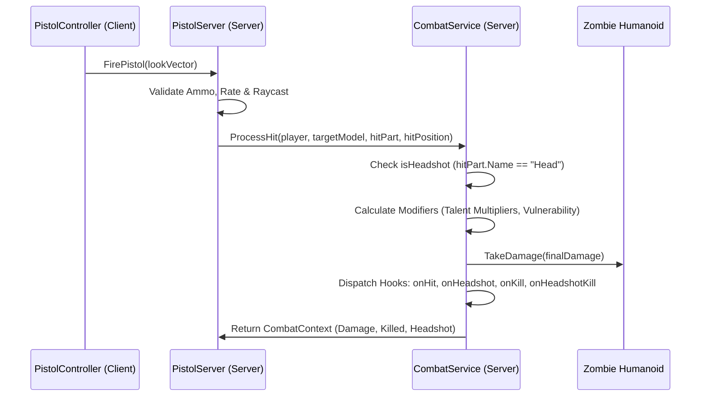

# Plan: FPS Rig Migration + Headshots + Talent Prototype

## 1. Actual Fps Rig asset inspection findings

Binary inspection of `assets/Fps Rig/FpsGlock.fbx` (1.36 MB, Kaydara FBX Binary, version 7400) reveals:
- **Meshes Present**:
  - `ArmModel`: Skinned mesh containing the complete first-person arms and hands.
  - `Glock19`: Complete 3D pistol model with separate movable parts.
- **Skeletal / Armature Hierarchy**:
  - `Armature`
    - Left Arm Chain: `UpperArm.L` → `LowerArm.L` → `Hand.L` → finger bones (`DoubleFingersBeginning`, `DoubleFingers.L`, `DoubleFingersTip.L`).
    - Right Arm Chain: `UpperArm.R.001` → `LowerArm.R.001` → `Hand.R.001` → finger bones.
    - Weapon Bone Chain: `Root` (weapon root bone) → `Slide`, `Trigger`, `Magazine`, `SlideCatch`.
- **Embedded Animation Stacks (5 Clips)**:
  1. `Armature|Idle` — looped stationary idle holding pose.
  2. `Armature|Shoot` — firing impulse with slide recoil blowback.
  3. `Armature|Reload` — full tactical reload sequence animating hands, slide, and magazine ejection/insertion.
  4. `Armature|Inspect` — weapon inspection rotation.
  5. `Armature|Grip` — base grip alignment pose.
- **Rig Suitability Assessment**:
  The rig is a self-contained, professionally rigged FPS asset where both arms and weapon mechanisms share a unified armature. The slide, trigger, and magazine are already rigged to dedicated bones. It is 100% suitable as our complete primary first-person viewmodel.

## 2. Manual Roblox import requirements

> [!IMPORTANT]
> Raw FBX files in the repository cannot be used directly as live Roblox instances by Rojo. They must be imported into Roblox Studio using the native 3D Importer and converted to a `.rbxm` model before runtime code can clone them.

### Step-by-Step Developer Import Guide:
1. Launch Roblox Studio and open the project place (connected to Rojo).
2. Go to **Avatar** (or **Home**) tab → click **3D Importer** (or Import 3D).
3. Select `assets/Fps Rig/FpsGlock.fbx`.
4. In the 3D Importer settings:
   - Rig Type: Verify it detects a custom Rig / Model with bones.
   - Animations: Check **Import Animations** (ensure `Idle`, `Shoot`, `Reload`, and `Inspect` are checked).
   - Textures: Import embedded textures/materials.
   - Click **Import**.
5. Studio creates a Model in `Workspace` containing:
   - `AnimationController` and `Animator`.
   - `ArmModel` and `Glock19` MeshParts with Bone hierarchy.
   - Nested `Animation` objects for each clip.
6. **Publish Animations**:
   - For each imported animation (`Idle`, `Shoot`, `Reload`), right-click → **Save to Roblox** (Publish Animation).
   - Copy the generated `rbxassetid://...` IDs.
   - Enter them into `src/client/ViewmodelConfig.luau` (`AnimationIds.Idle`, `Fire`, `Reload`).
7. **Save Model as RBXM**:
   - Right-click the imported Model in Workspace → **Save to File...**
   - Save directly to `assets/FpsGlock.rbxm`.
   - Rojo will instantly synchronize this into `ReplicatedStorage.Assets.FpsGlock`!

## 3. New runtime viewmodel architecture

- **Cloning Source**: `ReplicatedStorage.Assets:WaitForChild("FpsGlock")`.
- **Placement**: Client-only clone parented to `workspace.CurrentCamera`.
- **Part Configuration**:
  - Traverse all BaseParts in the clone:
    - `CanCollide = false`, `CanTouch = false`, `CanQuery = false`.
    - `CastShadow = false`, `Massless = true`.
  - Identify root part (`Root` or PrimaryPart) and set `Anchored = true`. All articulate bone-driven MeshParts remain `Anchored = false`.
- **Camera Following**:
  - In `RenderStepped`, position root part:
    ```luau
    viewmodelRoot.CFrame = camera.CFrame * Config.CameraOffset * currentBobOffset * recoilOffset
    ```
- **Local Character Invisibility**:
  - Maintain `LocalTransparencyModifier = 1` on real character limbs on spawn and per-frame.

## 4. Exact old-viewmodel removal/migration strategy

1. **Retire from `ViewmodelController.luau`**:
   - Remove `cloneCharacter()` and `character.Archivable` hacks.
   - Remove `keptParts` and R15 character arm extraction loops.
   - Remove synthetic `RightGrip` creation and manual `preparePistol()` logic.
   - Remove fallback procedural rest pose math (the imported `Idle` clip handles the holding stance natively).
2. **Retire from `ViewmodelConfig.luau`**:
   - Remove obsolete `RightGripC0` and `RightGripC1`.
   - Remove old R15 `PistolIdle` ID (`rbxassetid://105188840604362`).
3. **Repository Assets**:
   - `assets/Pistol.rbxm` and `assets/Arms.rbxm` remain untouched in Git as archival backups, but are no longer referenced at runtime.

## 5. Animation playback strategy

- **Idle**:
  - Loaded with `Priority = Enum.AnimationPriority.Idle`, `Looped = true`.
  - Begins playing automatically as soon as the viewmodel is spawned.
- **Fire (`Shoot`)**:
  - Loaded with `Priority = Enum.AnimationPriority.Action`, `Looped = false`.
  - Triggered in `ViewmodelController.playFireFeedback()`.
  - Plays the slide blowback and arm impulse animation alongside procedural recoil kick.
- **Reload**:
  - Loaded with `Priority = Enum.AnimationPriority.Action`, `Looped = false`.
  - Triggered when `player:GetAttribute("PistolReloading") == true`.
  - **Playback Speed Synchronization**:
    If the animation clip duration (`track.Length`) differs from gameplay `PistolConfig.ReloadDuration` (1.5s), calculate:
    ```luau
    local speed = if track.Length > 0 then (track.Length / PistolConfig.ReloadDuration) else 1
    track:AdjustSpeed(speed)
    track:Play(0.05)
    ```
    This guarantees the visual reload finishes in precisely 1.5 seconds without modifying authoritative server gameplay timing.
- **Failure Resilience**:
  - All track loading and playback calls are wrapped in `pcall`. If animation IDs are missing or fail to load, shooting, aiming, and server raycasting continue unimpeded.

---

## 6. Headshot integration

- Hitscan validation runs exclusively on the server in `PistolServer.luau`.
- Server performs `workspace:Raycast(head.Position, aimDirection.Unit * PistolConfig.Range, params)`.
- When a hit occurs:
  ```luau
  local hitPart = result.Instance
  local isHeadshot = (hitPart.Name == "Head")
  ```
- **Damage Formula**:
  - Base damage = `25`.
  - Headshot multiplier = `2.0`.
  - Base hit = `25` damage (4 shots to kill 80 HP zombie).
  - Headshot hit = `50` damage (2 shots to kill 80 HP zombie).
- Client never sends headshot flags; the server computes this strictly from the physical part intersected by the raycast.

## 7. Combat event/modifier flow

To prevent `PistolServer.luau` from bloating into an unmaintainable monolith, hit processing is delegated to `src/server/CombatService.luau`:



### Context Schema:
```luau
type CombatContext = {
    Player: Player,
    Target: Model,
    HitPart: BasePart,
    IsHeadshot: boolean,
    BaseDamage: number,
    FinalDamage: number,
    Killed: boolean,
    HitPosition: Vector3,
    WeaponId: string,
}
```

## 8. XP & level formula

- **Per-Run Progression**: State resets on new server session (no persistent DataStore).
- **Kill Reward**: `ZombieKillXP = 10`.
- **Threshold Formula**:
  $$\text{RequiredXP}(\text{level}) = 30 + ((\text{level} - 1) \times 10)$$
  - Level 1 → 2: 30 XP (3 kills)
  - Level 2 → 3: 40 XP (4 kills)
  - Level 3 → 4: 50 XP (5 kills)
  - Level 4 → 5: 60 XP (6 kills)
- **Replication via Player Attributes**:
  - `PlayerLevel`: `number` (default 1)
  - `PlayerXP`: `number` (default 0)
  - `PlayerRequiredXP`: `number` (default 30)
  - `PendingTalentChoices`: `number` (default 0)
- **Anti-Duplication**:
  Each zombie model receives attribute `XPAwarded = true` on death. XP cannot be awarded more than once per zombie instance.

## 9. Player run-state/stat architecture

Implemented in `src/server/ProgressionService.luau`:
```luau
type PlayerCombatStats = {
    BaseDamageMultiplier: number,       -- default 1.0
    HeadshotDamageMultiplier: number,   -- default 1.0 (multiplies 2.0x base headshot)
    ReloadDurationMultiplier: number,   -- default 1.0 (1.0 = normal, 0.8 = -20% duration)
    MagazineBonus: number,              -- default 0 (+4, +8)
    MaxHealthBonus: number,             -- default 0 (+20, +40)
    PiercingCount: number,              -- default 0 (bullets pierce N extra zombies)
    DeadeyeStreak: number,              -- default 0 (consecutive headshots)
    CombatReloadBonus: number?,         -- temporary next-reload reduction
    OwnedTalents: { [string]: { Tier: string, Count: number } },
    VoltaBoonCount: number,             -- prerequisite tracking
}
```
- Fully server-authoritative.
- Modifiers calculate dynamically through `ProgressionService.getStats(player)`.

## 10. Talent definitions & schema

Defined in `src/shared/TalentDefinitions.luau`:
```luau
type TalentTier = {
    Rarity: "Blue" | "Purple" | "Red" | "Gold",
    Description: string,
    Values: { [string]: number },
}

type TalentDefinition = {
    Id: string,
    Name: string,
    Category: "Neutral" | "Professor Volta" | "Sergeant Bravo",
    Tiers: {
        Blue: TalentTier?,
        Purple: TalentTier?,
        Red: TalentTier?,
        Gold: TalentTier?,
    },
    Prerequisites: { RequiredTalents: { string }?, MinCategoryCount: number? }?,
    OnSelected: ((player: Player, tier: string) -> ())?,
}
```

## 11. Rarity and roll rules

- **Rarities**:
  - `Blue` (Rare): Core building blocks.
  - `Purple` (Epic): Enhanced tier.
  - `Red` (Mythic): Prerequisite-gated game-changers.
  - `Gold` (Legendary): Excluded from normal level-up rolls.
- **Roll Weights (per Altar slot)**:
  - Base: 75% Blue, 25% Purple.
  - If a slot rolls and the player satisfies prerequisites for an unowned Red (Mythic) talent: 15% promotion chance to offer that Mythic talent.
- **Anti-Duplicate & Max-Tier Filtering**:
  - The 3 altars never offer duplicate talents in the same roll.
  - If player already owns Purple (max tier) of a talent, it is excluded from future rolls.
  - If player owns Blue of a talent, only the Purple upgrade is offered.

## 12. Upgrade/stacking rules

- Talents have a single active tier at a time.
- Upgrading Blue → Purple overwrites the magnitude (e.g. Sharpshooter Blue +25% → Purple +45%; they do **not** stack additively to +70%).
- Mythics are unique and cannot be rolled or upgraded further once owned.

## 13. All 12 prototype talents

### Neutral Talents
1. **Sharpshooter**:
   - Blue: +25% Headshot Damage.
   - Purple: +45% Headshot Damage.
2. **Quick Hands**:
   - Blue: Reload duration -20% (1.2s reload).
   - Purple: Reload duration -35% (0.975s reload).
3. **Extended Magazine**:
   - Blue: +4 magazine capacity (16 total).
   - Purple: +8 magazine capacity (20 total).
4. **Vitality**:
   - Blue: +20 MaxHealth (120 HP total).
   - Purple: +40 MaxHealth (140 HP total).

### Professor Volta (Lightning & Shock)
5. **Arc Discharge**:
   - Blue: On headshot, chain lightning strikes 1 nearby living zombie within 18 studs for 20 damage.
   - Purple: Chain lightning strikes up to 2 nearby living zombies for 25 damage.
   - *Safety*: Chain hits do not trigger secondary chain recursion or duplicate kill XP.
6. **Static Shock**:
   - Blue: Headshot has 20% chance to shock/stun target for 1.0s (`WalkSpeed = 0`).
   - Purple: 35% chance to stun target for 1.5s.
   - *Safety*: Restores `WalkSpeed` safely using a timestamp token; death clears stun immediately.
7. **Conductive Target**:
   - Purple-only: Shocked enemies take +25% damage from all damage sources while stunned.
8. **Tesla Cascade** (Red / Mythic):
   - *Prerequisites*: Player owns `Arc Discharge` AND at least one other Volta boon (`Static Shock` or `Conductive Target`).
   - *Effect*: Arc Discharge chain lightning jumps to +3 additional zombies (up to 4–5 total).
   - *Safety*: Visited zombie tracking prevents hitting the same enemy twice per cascade.

### Sergeant Bravo (Ballistics & Piercing)
9. **AP Core**:
   - Blue: Bullet pierces 1 additional zombie along trajectory.
   - Purple: Bullet pierces 2 additional zombies.
   - *Implementation*: Raycast iterates through hit zombie models using `RaycastParams.FilterDescendantsInstances` exclusion until piercing count is exhausted.
10. **Large Caliber**:
    - Blue: +20% base bullet damage (30 dmg).
    - Purple: +35% base bullet damage (33.75 dmg).
11. **Combat Reload**:
    - Blue: On headshot kill, next reload duration is reduced by -30% (consumed on reload).
    - Purple: Next reload duration is reduced by -50%.
12. **Deadeye** (Red / Mythic):
    - Red / Mythic.
    - Consecutive headshots grant +10% headshot damage per hit (up to max +50%, 5 stacks).
    - Hitting a body shot or missing resets the streak to 0.

---

## 14. Mythic prerequisite logic

- Checked server-side during Altar roll generation:
  ```luau
  local function isEligible(player, talentDef): boolean
      if not talentDef.Prerequisites then return true end
      local stats = ProgressionService.getStats(player)
      if talentDef.Prerequisites.RequiredTalents then
          for _, reqId in talentDef.Prerequisites.RequiredTalents do
              if not stats.OwnedTalents[reqId] then return false end
          end
      end
      if talentDef.Prerequisites.MinCategoryCount then
          local count = 0
          for id in stats.OwnedTalents do
              if TalentDefinitions[id].Category == talentDef.Category then
                  count += 1
              end
          end
          if count < talentDef.Prerequisites.MinCategoryCount then return false end
      end
      return true
  end
  ```

## 15. Three physical Talent Altars

- **World Placement**:
  Three pedestal models situated on the Baseplate in an arc near player spawn:
  - Altar 1: `Vector3.new(-8, 2, 20)`
  - Altar 2: `Vector3.new(0, 2, 22)`
  - Altar 3: `Vector3.new(8, 2, 20)`
- **Visual Display**:
  - Pedestal BasePart (Anchored, CanCollide).
  - Overhead BillboardGui / SurfaceGui:
    - Talent Name (Bold, GothamFont).
    - Category / Patron tag.
    - Rarity Badge with distinct border & text color:
      - Blue: `Color3.fromRGB(50, 160, 255)`
      - Purple: `Color3.fromRGB(185, 75, 255)`
      - Red: `Color3.fromRGB(255, 60, 60)`
    - Formatted description of bonuses.
- **Interaction**:
  - Each altar contains a `ProximityPrompt`:
    - `ActionText = "Choose Talent"`
    - `HoldDuration = 0.6`
    - `RequiresLineOfSight = false`
    - `MaxActivationDistance = 10`

## 16. Server-side validation

When a player triggers an Altar's `ProximityPrompt`:
1. Server verifies player is alive and character is in workspace.
2. Server verifies `player:GetAttribute("PendingTalentChoices") > 0`.
3. Server verifies the altar has an active offered talent.
4. Server grants the talent, updates `PlayerCombatStats`, applies stat modifiers (e.g. MaxHealth, Magazine size).
5. Server decrements `PendingTalentChoices -= 1`.
6. Server clears all 3 altars.
7. If `PendingTalentChoices > 0`, server immediately rolls 3 new choices for the remaining pending level-up.

## 17. Debug / test mode

In `src/shared/TalentConfig.luau`:
```luau
return {
    DebugMode = false, -- set true in Studio to test specific tiers
    DebugRollSlots = {
        Slot1 = "Blue",
        Slot2 = "Purple",
        Slot3 = "Red", -- bypasses prerequisites for immediate testing
    },
    FastLeveling = false, -- 1 kill = 1 level
}
```

---

## 18. Files to create

### Phase A:
- *None.* (Uses existing `ViewmodelController.luau` and `ViewmodelConfig.luau`).

### Phase B:
1. `src/shared/TalentDefinitions.luau` — Complete definitions of the 12 prototype talents, tiers, stats, and prerequisites.
2. `src/shared/TalentConfig.luau` — Roll weights, debug mode settings, altar positions.
3. `src/shared/ProgressionConfig.luau` — Kill XP values and leveling formulas.
4. `src/server/CombatService.luau` — Centralized hitscan damage calculation, headshot evaluation, and talent hook dispatch.
5. `src/server/ProgressionService.luau` — XP accumulation, level threshold calculation, player combat stat tracking.
6. `src/server/TalentAltars.luau` — Spawns physical altar pedestals, manages rolling, renders displays, and validates ProximityPrompts.

## 19. Files to modify

### Phase A:
1. `default.project.json` — verify `assets/` maps to `ReplicatedStorage.Assets`.
2. `src/client/ViewmodelConfig.luau` — set `FpsGlock` camera offsets, recoil parameters, and animation IDs (`Idle`, `Fire`, `Reload`).
3. `src/client/ViewmodelController.luau` — replace character-clone arms with `ReplicatedStorage.Assets.FpsGlock` clone, wire `Idle`, `Fire`, and `Reload` animation tracks.

### Phase B:
4. `src/shared/PistolConfig.luau` — add `HeadshotMultiplier = 2.0`.
5. `src/server/PistolServer.luau` — route raycast hits through `CombatService.processHit()`; update magazine size from player stats.
6. `src/server/Zombie.luau` — award kill XP to credited player on death; support shock stun without walkspeed corruption.
7. `src/server/init.server.luau` — initialize `ProgressionService` and `TalentAltars`.

## 20. Files to leave unchanged

- `src/client/Crosshair.luau`
- `src/client/AmmoGui.luau`
- `src/client/PistolController.luau`
- `src/client/SprintController.luau`
- `src/server/ZombieSpawner.luau`
- `src/shared/ZombieConfig.luau`
- `src/shared/HordeConfig.luau`
- `src/shared/CollisionGroups.luau`
- `src/shared/Remotes.luau`
- Raw assets in `assets/Fps Rig/` and `assets/Fps Rig AKM/`

---

## 21. Phase A implementation order

1. **Studio Asset Import**: Developer imports `assets/Fps Rig/FpsGlock.fbx` via Studio 3D Importer, publishes animations, and saves model as `assets/FpsGlock.rbxm`.
2. **Viewmodel Configuration**: Configure `ViewmodelConfig.luau` with new animation IDs and tuned `CameraOffset`.
3. **Viewmodel Controller Refactor**: Clean out old character-clone and `RightGrip` code from `ViewmodelController.luau`; clone `FpsGlock`; connect `Idle`, `Fire`, and `Reload` tracks.
4. **Phase A Studio Test**: Verify new Glock and arms follow camera, loop idle, play fire on LMB, play reload on R/auto-reload.
5. **Phase A Commit**: Commit Phase A code cleanly.

## 22. Phase A Studio checklist

- [ ] New Glock and arms appear cleanly in first-person view.
- [ ] No old character arm geometry or floating parts appear.
- [ ] `Idle` animation loops smoothly while stationary.
- [ ] Clicking LMB fires, plays `Fire` animation, and applies cosmetic recoil.
- [ ] Pressing R plays `Reload` animation, completes in 1.5s, and fills magazine.
- [ ] Walking and sprinting bobbing function smoothly on top of new rig.
- [ ] Server shooting, zombie pursuit, and damage remain completely functional.

---

## 23. Phase B implementation order

1. **Shared Definitions**: Create `ProgressionConfig.luau`, `TalentDefinitions.luau`, and `TalentConfig.luau`.
2. **Combat Service & Headshots**: Create `CombatService.luau` with `HeadshotMultiplier = 2.0`; route `PistolServer.luau` raycast hits through it.
3. **XP & Progression**: Create `ProgressionService.luau`; update `Zombie.luau` to award XP on kill and trigger level-ups.
4. **Physical Altars**: Create `TalentAltars.luau` to construct the 3 pedestals, display rolled talents, and handle `ProximityPrompt` selection.
5. **Talent Implementations**: Implement the 12 prototype talents (stats, lightning chain, stun, piercing ray, streak counters).
6. **Phase B Studio Test**: Verify headshots deal 50 damage, XP accrues, altars spawn on level-up, and all 12 talents apply effects correctly.
7. **Phase B Commit**: Commit Phase B code cleanly.

## 24. Phase B Studio checklist

- [ ] Raycast to zombie head deals 50 damage (kills 80 HP zombie in 2 shots).
- [ ] Raycast to zombie torso/legs deals 25 damage (4 shots to kill).
- [ ] Killing zombies awards 10 XP; XP bar/attributes update properly.
- [ ] Reaching 30 XP triggers level-up and populates the 3 physical altars.
- [ ] Holding E on an altar grants the talent and updates player stats immediately.
- [ ] Altars clear and do not permit duplicate claims.
- [ ] Arc Discharge / Tesla Cascade chains lightning without crashing or infinite loops.
- [ ] AP Core bullet pierces through front zombie into rear zombie.
- [ ] Deadeye builds streak on consecutive headshots and resets on body hit/miss.
- [ ] Output window remains free of runtime errors.

---

## 25. Risks and edge cases

1. **FBX scale discrepancy**:
   - *Risk*: Imported FBX model is microscopic or enormous in Studio.
   - *Mitigation*: 3D Importer allows setting File Scale or Model:ScaleTo() to normalize dimensions to ~2 studs.
2. **Reload animation duration mismatch**:
   - *Risk*: Imported reload clip is 2.5s while server reload duration is 1.5s.
   - *Mitigation*: Dynamically adjust animation speed via `track:AdjustSpeed(track.Length / 1.5)` so visual reload matches server timing exactly.
3. **Infinite lightning recursion**:
   - *Risk*: Arc Discharge / Tesla Cascade chains back and forth between two zombies forever.
   - *Mitigation*: Maintain a `visitedTargets` table; each zombie can be struck at most once per shot. Secondary hits cannot trigger new chains.
4. **Stun state persisting after death**:
   - *Risk*: Static Shock sets `WalkSpeed = 0`, and zombie dies or respawns with 0 speed.
   - *Mitigation*: Check `humanoid.Health > 0` before restoring speed; death cleanup destroys the instance.
5. **Piercing ray infinite loop**:
   - *Risk*: Piercing raycast hits the same part repeatedly.
   - *Mitigation*: Accumulate all hit zombie models into `params.FilterDescendantsInstances` array and cast from `result.Position + rayDir * 0.1`.

## 26. Definition of done

- Phase A: First-person viewmodel cleanly uses the imported `FpsGlock` rig with working `Idle`, `Fire`, and `Reload` animations, fully retiring the old R15 character viewmodel.
- Phase B: Server accurately detects headshots (50 dmg vs 25 body dmg), awards run-based XP, triggers level-ups, and operates three interactive physical Talent Altars.
- All 12 prototype talents function with Blue/Purple/Red tiers and prerequisite validation.
- All gameplay authority remains strictly server-side.
- Zero errors or warnings in Studio Output.
